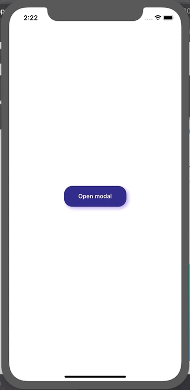

# React Native Gesture Bottom Sheet

Need a lightweight and easy-to-use bottom sheet component? Here it is!

A cross-platform Bottom Sheet component which supports gestures.



- Checkout the [example/](https://github.com/kcotias/react-native-gesture-bottom-sheet/tree/master/examples) folder for use example.

## Features

- Smooth animations and gestures
- Highly customizable
- Very lightweight

## Installation

Open a Terminal in the project root and run:

```sh
yarn add react-native-gesture-bottom-sheet
```

## Quick Start

```js
import React, { useRef } from "react";
import { SafeAreaView, TouchableOpacity, Text, StyleSheet } from "react-native";
import BottomSheet from "react-native-gesture-bottom-sheet";
import styles from "./styles";

const Example = () => {
  // Needed in order to use .show()
  const bottomSheet = useRef();

  return (
    <SafeAreaView style={styles.container}>
      <BottomSheet hasDraggableIcon ref={bottomSheet} height={600} />
      <TouchableOpacity
        style={styles.button}
        onPress={() => bottomSheet.current.show()}
      >
        <Text style={styles.text}>Open modal</Text>
      </TouchableOpacity>
    </SafeAreaView>
  );
};

const styles = StyleSheet.create({
  button: {
    height: 50,
    width: 150,
    backgroundColor: "#140078",
    justifyContent: "center",
    alignItems: "center",
    borderRadius: 20,
    shadowColor: "#8559da",
    shadowOpacity: 0.7,
    shadowOffset: {
      height: 4,
      width: 4
    },
    shadowRadius: 5,
    elevation: 6
  },
  text: {
    color: "white",
    fontWeight: "600"
  },
  container: {
    flex: 1,
    justifyContent: "center",
    alignItems: "center"
  }
});

export default Example;
```

### Props

##### `height` - integer (`required`)

Sets the panel size.

##### `hasDraggableIcon` - boolean (`Default - false`)

Controls visibility of the draggable icon on top of the modal.

##### `draggable` - boolean (`Default - true`)
Specify whether the panel is draggable or not.

##### `modal` - boolean (`Default - true`)
Specify whether the panel is implemented as a `<Modal />` or  as a `<View />` component.
